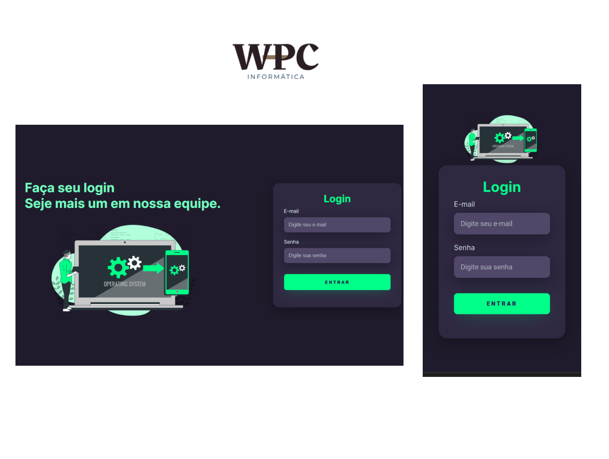

## Tela de login feita com HTML e CSS puros.

# Indice

- [Sobre](#-sobre)
- [Tecnologias](#Tecnologias)
- [Como acessar o projeto](#-como-acessar-o-projeto)

## 🔖&nbsp; Sobre

Pagina de Login básica com html e css puros.

---

## Tecnologias

Esse projeto foi desenvolvido com as seguintes tecnologias:

- [HTML](https://www.w3schools.com/html/)
- [CSS](https://www.w3schools.com/css/)

## Como acessar o projeto

[Clique aqui](https://willtechcod.github.io/Home-Login/)

---

<h3 align="center" >Vamos nos conectar 😉</h3>

  &ensp;
  &ensp;
  

 

    Desenvolvido 💜 por William Pereira Da Conceição

